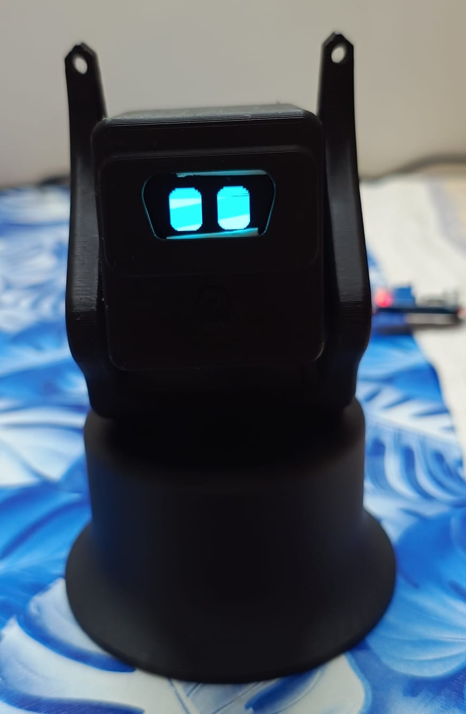
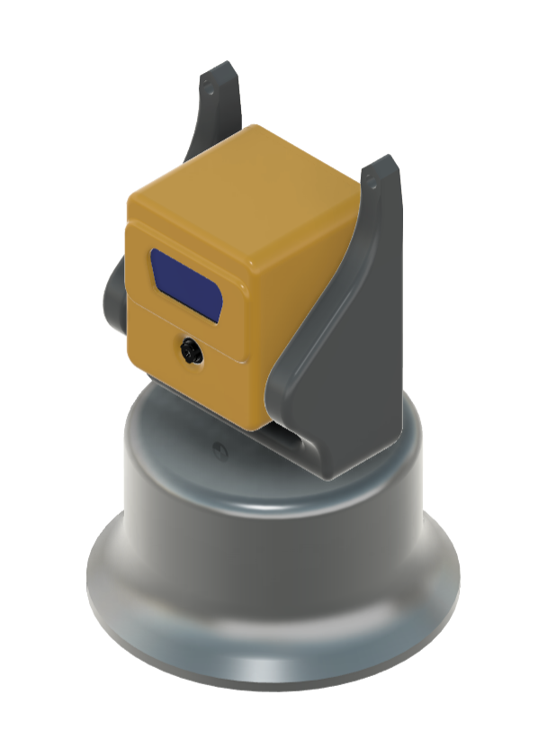
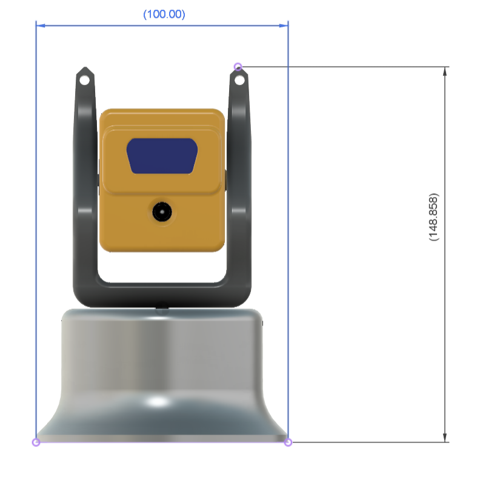

#  Robot Pet - v1: An ESP32-CAM Face-Tracking Companion

A desktop robot pet built around a single **AI-Thinker ESP32-CAM**. It streams video to a laptop, finds a face (or any coloured object you show it), and turns its head to follow you — while an OLED display gives it a pair of animated eyes that blink, glance around, and change mood.

<p align="center">
    
    
    
</p>

The whole robot runs on one ESP32-CAM: camera, two servos, and an I²C display, with the vision work offloaded to a laptop over plain HTTP.

## 🔁 My Other Robotics Projects

- 🔗 [**Kai (ಕೈ) — 5 DOF Robotic Arm**](https://github.com/RKTheOneAndOnly/5-DOF-Robot_Arm-RK)
- 🔗 [**Robotics-Arm-Project-V01** — 3 DOF arm](https://github.com/RKTheOneAndOnly/Robotics-Arm-Project-V01)

---
## Table of Contents

1. [Introduction](#1-introduction)
2. [Components Used](#2-components-used)
3. [How It Works](#3-how-it-works)
4. [Wiring & Pin Map](#4-wiring--pin-map)
5. [Build & Flash](#5-build--flash)
6. [Running the Tracker](#6-running-the-tracker)
7. [Tuning](#7-tuning)
8. [Future Plans](#8-future-plans)
9. [Repository Structure](#9-repository-structure)
10. [Credits & Acknowledgements](#10-credits--acknowledgements)

---
## 1. Introduction

This project builds a small companion robot that:

- Streams **MJPEG video over WiFi** from an ESP32-CAM
- Tracks a **face** (Haar cascade) or any **coloured object** (HSV blob — hold up an apple)
- Drives **pan and tilt servos** to keep the target centred in frame
- Shows **animated, mood-driven eyes** on a 128×64 I²C OLED
- Is fully 3D printable, using cheap and widely available parts

The split of responsibilities is deliberate: the ESP32 handles hardware and owns all servo angles and limits, while the laptop does the computer vision. Vision never sends an absolute angle - it only says *"turn this far, this way"* - so a bug in the Python code can never drive the head into its mechanical stops.

---
## 2. Components Used

| Component                         | Quantity | Notes                                       |
|-----------------------------------|----------|---------------------------------------------|
| AI-Thinker ESP32-CAM (OV2640)     | 1        | Main controller + camera                    |
| SG90 micro servo                  | 2        | Pan and tilt                                |
| 1.3 " I²C OLED, 128×64            | 1        | 1.3 inch I2C OLED Display Module 4pin Blue Color       |
| USB-to-TTL adapter (FTDI/CP2102)  | 1        | Flashing only — the ESP32-CAM has no USB    |
| 5V power supply, ≥1A              | 1        | **Separate supply for the servos**          |
| 3D printed parts                  | 5        | STEP files in [`/cad`](./cad)               |
| Jumper wires, M2/M3 screws        | –        | Assembly hardware                           |

> ⚠️ **Do not power the servos from the ESP32-CAM's 5V/3.3V pin.** Two SG90s under load will brown out the onboard regulator and reset the board mid-stream.

---
## 3. How It Works

```
   ESP32-CAM                                          Laptop (Python)
  ┌──────────────────────────────┐                  ┌──────────────────────────┐
  │  httpd :81  /stream  ────────┼── MJPEG ────────►│  reader                  │
  │  httpd :80  /control ◄───────┼── HTTP GET ──────┼─ sender                  │
  │                              │                  │                          │
  │  Display Controll            │                  │  detect using Open CV    │
  │  servos Controll             │                  └──────────────────────────┘
  └──────────────────────────────┘
```

**On the ESP32** - two independent `esp_http_server` instances, matching the layout of the Espressif `CameraWebServer` example. Port 81 serves the MJPEG stream; port 80 answers control requests. They *must* be separate servers: an httpd instance handles one request at a time, and the stream handler never returns while a viewer is connected, so a shared server would never answer a control request.

**On the laptop** - one thread reads the MJPEG stream and keeps only the newest frame, throwing away any backlog. The main loop decodes that frame, runs detection, smooths the target centroid, and computes a proportional step. A third thread issues the control request, so waiting for the ESP32 to reply never stalls tracking.

---
## 4. Wiring & Pin Map

The camera occupies almost every usable GPIO on this board — **including GPIO21/22**, the "default" ESP32 I²C pins. The OLED therefore cannot use them. These are the pins left over:

| Signal          | GPIO | Notes                                                  |
|-----------------|------|--------------------------------------------------------|
| Pan servo       | 2    | Strapping pin                                          |
| Tilt servo      | 13   |                                                        |
| OLED SDA        | 14   |                                                        |
| OLED SCL        | 15   |                                                        |


### Power

```
   5V supply ──┬── servo V+  (both servos)
               └── ESP32-CAM 5V

   GND ────────┬── servo GND (both servos)
               ├── ESP32-CAM GND      ← common ground is essential
               └── OLED GND
```

> 🔧 A loose common ground was the single hardest fault to find in this build. The servos simply do not move, the code looks wrong, and everything else keeps working perfectly. Check it first.

---
## 5. Build & Flash

Built with [PlatformIO](https://platformio.org/).

**1. Add your WiFi credentials** :

```bash
# edit include/wifi_config.h and set WIFI_SSID / WIFI_PASSWORD
```

**2. Flash the firmware**:

```bash
pio run -e esp32cam -t upload
```

> ✔️ If everything goes right the OLED shows the board's IP address once it joins WiFi.

**3. Check the camera** by opening `http://<esp32-ip>:81/stream` in a browser. This path is completely independent of the Python code, so it cleanly separates a camera/WiFi problem from a client problem.

### Servo bring-up test

A second environment builds a standalone sweep test — no camera, no WiFi, no display. Both servos sweep continuously so you can confirm the hardware works before blaming the software:

```bash
pio run -e servo_test -t upload
```

The onboard flash LED (GPIO4) blinks fast while sweeping up and slow while sweeping down, so you can confirm the sketch is running without a serial monitor attached. 
> ⚙️ **LED blinking but servos still?** That's power or wiring problem.

> Every SG90 has slightly different pulse-width endpoints. Centre both servos before assembling the head:

---
## 6. Running the Tracker

```bash
cd code/python
pip install -r requirements.txt

python track.py <esp32-ip>              # face tracking
python track.py <esp32-ip> color        # colour-blob tracking
```

| Key / action        | Effect                                        |
|---------------------|-----------------------------------------------|
| `f`                 | Face mode (Haar cascade)                      |
| `c`                 | Colour mode (HSV blob)                        |
| **click the video** | Sample the colour under the cursor and track it |
| `q`                 | Quit                                          |

>🤖 Colour mode is the easy way to test: hold up an apple, click it, and the robot follows it
---
## 7. Tuning

All tuning constants live at the top of [`code/python/track.py`](./code/python/track.py) — no reflashing needed.

| Constant           | Default | Effect                                                        |
|--------------------|---------|---------------------------------------------------------------|
| `DEADZONE_PX`      | 30      | Ignore errors smaller than this. Raise it if the head twitches on a still target. |
| `KP`               | 10      | Degrees of servo movement per pixel of error.                 |
| `MAX_STEP_DEG`     | 4       | Ceiling on any single move.                                   |
| `SMOOTHING`        | 0.5     | Centroid smoothing. 0 = raw and jumpy, 0.9 = heavy and laggy. |
| `SEND_INTERVAL_S`  | 0.08    | Minimum gap between movement commands.                        |
| `MOOD_INTERVAL_S`  | 2.0     | Minimum gap between mood updates; doubles as a keepalive.     |
| `DETECT_WIDTH`     | 300     | Detection runs on a copy scaled to this width.                |

> Setting `USE_SLIDERS = True` brings a live OpenCV trackbar window for all of the above plus the HSV thresholds.

---
## 8. Future Plans

- Add a microphone and simple sound reactions
- Battery power and a mobile base
- AI based pet controll

---
## 9. Repository Structure

```bash
├── code/
│   ├── include/
│   │   └── wifi_config.h            # Edit wifi credentials
│   ├── python/
│   │   ├── calibrate_servos.py      # centre the servos before assembly
│   │   ├── track.py                 # face / colour tracker
│   │   └── requirements.txt
│   ├── src/
│   │   ├── main.cpp                 # full firmware
│   │   └── servo_test.cpp           # standalone servo bring-up test
│   └── platformio.ini
├── cad/                             # STEP files for the printed parts
├── docs/
│   └── Photos /
│   └── Videos/
├── LICENSE
└── README.md
```

---
## 10. Credits & Acknowledgements

Special thanks to:
- The open-source robotics community, for the abundance of shared knowledge and tools.

> *Crafted with ❤️, driven by curiosity, and fueled by innovation.*
